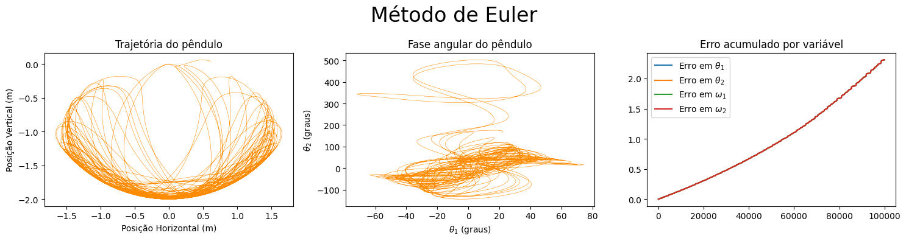
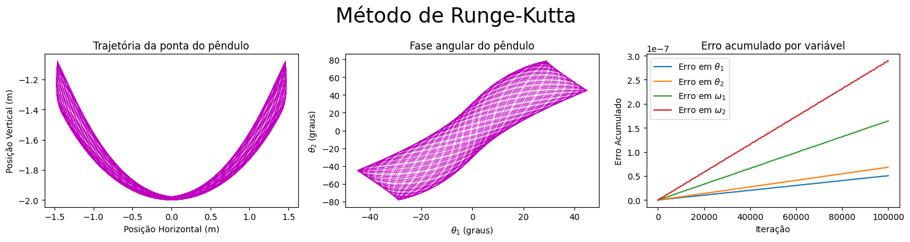
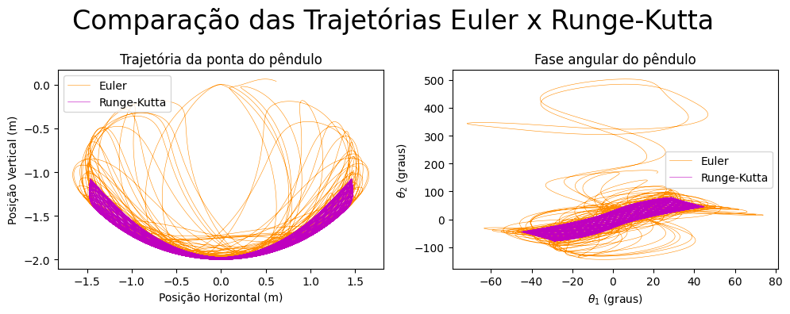

# The Double Pendulum

Double Pendulum is a quite simple physical system that can develop itself in a chaotic behavior. In this project I developed two diferent numerical methods (Euler and Runge-Kutta-Fehlberg), compare them and animate the Runge-Kutta results.

# Libraries

For this project you'll need: numpy, math, matplotlib (pyplot and animation) 

# Usage

The user can change the initial conditions of the system (masses, pendulum lenght, initial position and angular velocity).
The error tolerance is set to $10^{-5}$ and step $h = 10^{-3}$, but you can change according to your needs.
\\
The code returns a serie of charts from the Euler and RKF methods, including:

  * Pendulum position
  *  Angular phase
  *  Accumulated error for each variable
  * Comparative charts between Euler and RKF
  * Energy variation of the physical system

Examples are shown bellow:

# Complementary files

You can find the physical explanation with more details about the double pendulum model in the file "doublependulum_physics.md" 

The whole documentation is written in english, but my native language is portuguese. Therefore, all comments and some variables in the code is in portuguese.
